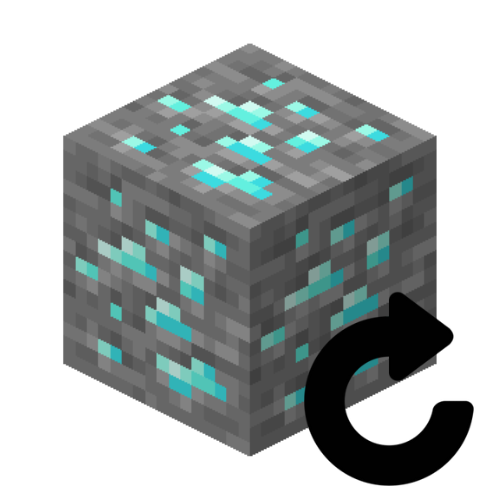

# MineSystem

  

(ENG) : In a defined world, when a player breaks an ore, it allows for it to be transformed into Bedrock and then retransformed into random ores after a certain amount of time.
  

(FRA) : Permet, dans un monde défini et quand un joueur casse un minerais, de le transformer en Bedrock, puis le retransformer en minerais aléatoire au bout d'un certains temps.
  

# Configuration :

(ENG) : In the `plugin_data/Mine/config.yml` folder, specify the world, messages for prohibiting the placement or breaking of any block other than ore, and the respawn time of the ore in seconds.  

(FRA) : Dans le dossier `plugin_data/Mine/config.yml` , indiquez le monde, les messages d'interdictions de placer ou casser un autre bloc qu'un minerais, et le temps de réapparition du minerais en seconde.  

# ToDo ?

| ToDo | ❔ |
| :----: | :----: |
| bypass permission | ✔ |
| optimization | ❌ |

# My discord :

You can join <a href="https://discord.gg/NkZu7DNKEn">here</a> !
