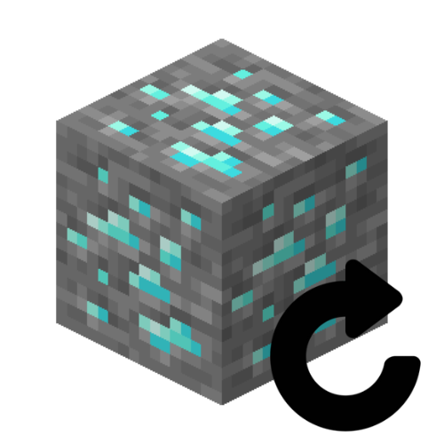

# MineSystem

  

(ENG) : Allows defining multiple mining zones with different ores and respawn times.
  

(FRA) : Permet de définir plusieurs zones de minage, avec des minerais et des temps de réapparition différents.
  

# Configuration :

(ENG) : In the `plugin_data/MineSystem/zone.yml` folder, specify the world, messages for prohibiting the placement or breaking of any block other than ore, and the respawn time of the ore in seconds.  

(FRA) : Dans le dossier `plugin_data/MineSystem/zone.yml` , indiquez le monde, les messages d'interdictions de placer ou casser un autre bloc qu'un minerais, et le temps de réapparition du minerais en seconde.  

# ToDo ?

| ToDo | ❔ |
| :----: | :----: |
| optimization | ✔ |
| bedrock after crash/redem | ✔ |
| configurable allowed blocks | ✔ |
| unlimited zones | ✔ |
| blocks and timer per zones | ✔ |

# My discord :

You can join <a href="https://discord.gg/NkZu7DNKEn">here</a> !
